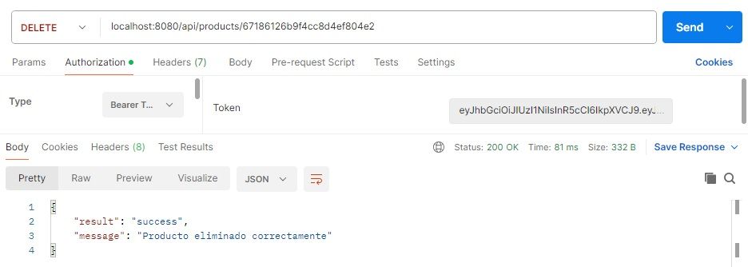

# Entrega Final del Curso de PROGRAMACION BACKEND II de CODERHOUSE

### Descripción del proyecto:

Desarrollo de un servidor basado en Node.JS y express. Contiene los endpoints y servicios necesarios para gestionar los productos y carrito de compras de un E-commerce.
Tiene los grupos de rutas /api/products, /api/carts y api/sessions.
Incorpora:

- Motor de plantillas Handlebars para las vistas.
- Websockets.
- Mongo como sistema de persistencia.
- Sistema de autorización y autenticación (aplica JWT).
- Variables de entorno.
- Arquitectura por capas en todo el proyecto. Se aplica los conceptos DAO, DTO y patrón Repository para manejo de sesiones y usuarios.
- Mailing.

### Pasos para probar el proyecto:

- Desde una terminal clonar el proyecto en su máquina local

```batch
git clone https://github.com/ingridlch/EntregaBackend2.git
```

- Situarse en el directorio del proyecto que se creó al clonar e instalarlo con:

```batch
npm install
```

- Configurar las variables de entorno en el archivo .env ubicado en la raíz del proyecto. En env.example se listan cuales se deben configurar.

### Endpoints de la API

Se incluyen capturas de pruebas realizadas en Postman que demuestran su funcionamiento.

**GET** `/api/products`: Obtiene la lista de productos, acepta parámetros por query:

- limit: permite devolver sólo el número de elementos indicados, en caso de no recibir el valor por defecto es 10.
- page: permite devolver la página que se quiere buscar, en caso de no recibir el valor por defecto es 1.
- query: permite buscar por categoría o disponibilidad, en caso de no recibir no hace filtro.
- sort: asc/desc permite devolver el listado ordenado por precio, en caso de no recibir no realiza ordenamiento.
  

**GET** `/api/products/:pid`: Obtiene el producto correspondiente al id pasado en el parámetro pid.\


**POST** `/api/products`: Crea un nuevo producto. Todos los campos son obligatorios exceptuando thumbnails: title:String, description:String, code:String, price:Number, stock:Number, category:String, thumbnails:Array de Strings que contiene las rutas a las imágenes del producto. Sólo habilitado para usuario admin, se debe pasar el token correspondiente.


**PUT** `/api/products/:pid`: Actualiza el producto correspondiente al id pasado en el parámetro pid con los campos enviados desde el body. Sólo habilitado para usuario admin, se debe pasar el token correspondiente.


**DELETE** `/api/products/:pid`: Elimina el producto correspondiente al id pasado en el parámetro pid. Sólo habilitado para usuario admin, se debe pasar el token correspondiente.


**POST** `/api/carts`: Crea un nuevo carrito. Recibe desde el body el array products que contiene los objetos que representan cada producto con las propiedades product (entero con el id del producto) y quantity (entero que contiene el número de ejemplares del producto). Sólo habilitado para usuario user, se debe pasar el token correspondiente.


**GET** `/api/carts/:cid`: Lista los productos del carrito correpondiente al id pasado en el parámetro cid con su detalle.


**POST** `/api/carts/:cid/product/:pid`: Agrega el producto cuyo id se pasa en el parámetro pid con el carrito de id cid. Si el producto ya estaba en el carrito aumenta su cantidad en una unidad. Sólo habilitado para usuario user, se debe pasar el token correspondiente.


**DELETE** `api/carts/:cid/products/:pid`: Elimina del carrito el producto seleccionado


**PUT** `api/carts/:cid`: Actualiza el carrito con un arreglo de productos. Recibe desde el body el array products que contiene los objetos que representan cada producto con las propiedades product (entero con el id del producto) y quantity (entero que contiene el número de ejemplares del producto). Sólo habilitado para usuario user, se debe pasar el token correspondiente.


**PUT** `api/carts/:cid/products/:pid`: Actualiza sólo la cantidad de ejemplares del producto pasado en el parámetro :pid para el carrito :cid. La cantidad se pasa en el parámetro quantity del body. Sólo habilitado para usuario user, se debe pasar el token correspondiente.


**DELETE** `api/carts/:cid`: Elimina los productos del carrito.


**POST** `api/carts/:cid/purchase`: Finaliza el proceso de compra del carrito. Se corrobora el stock del producto, descontando el correspondiente a los productos comprados y quedando en el carrito los sin stock. Se genera el ticket de la compra con los campos: id (generado por mongo), code (autogenerado), purchase_datetime (fecha y hora de la compra), amount (valor total de la compra), purchaser (correo del usuario), products (lista de productos comprados con su cantidad). Al finalizarse la compra se devuelve el listado de productos que quedaron en el carrito por no contar con stock. Se envía mail al comprador avisando que la misma finalizó exitosamente. Sólo habilitado para usuario user, se debe pasar el token correspondiente.


**POST** `api/sessions/register`: Crea un usuario con los parámetros pasados en el body: first_name:String, last_name:String, email:String (único), age:Number, password:String, cart:id con referencia a Carts, role:String.


**POST** `api/sessions/login`: Permite el login de un usuario con los parámetros pasados por body: email y password.


**GET** `api/sessions/current`: Valida el usuario logueado y devuelve en una respuesta sus datos.


**PUT** `api/sessions/:id`: Actualiza el usuario del id pasado en el parámetro :id con los parámetros pasados en el body.


**DELETE** `api/sessions/:id`: Elimina el usuario con el id pasado en el parámetro :id.


### Vistas

Se incluyen imágenes de pruebas que demuestran su funcionamiento.

`/products`: Devuelve la lista de productos con su respectiva paginación. Puede recibir distintos parámetros por query: limit, page, query y sort


`/carts/:cid`: Visualiza un carrito específico listando sólo los productos que pertenecen a ese carrito


`/realtimeproducts`: Devuelve la vista “realTimeProducts.handlebars” que contiene la lista de productos que trabaja con websockets para que se vaya actualizando en tiempo real.
