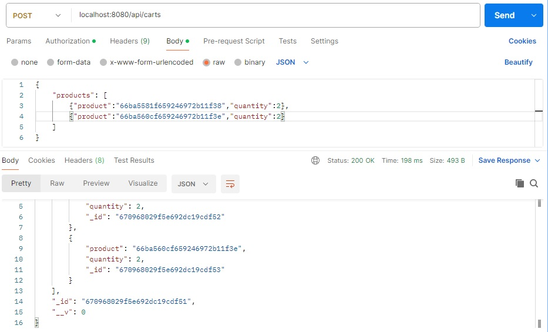

# Segunda entrega del Proyecto Final del Curso de PROGRAMACION BACKEND I de CODERHOUSE

### Descripción del proyecto:

Desarrollo de un servidor basado en Node.JS y express. Contiene los endpoints y servicios necesarios para gestionar los productos y carrito de compras de un E-commerce.
Escucha en el puerto 8080 y tiene los grupos de rutas /products y /carts.

### Pasos para probar el proyecto:

- Desde una terminal clonar el proyecto en su máquina local

```batch
git clone https://github.com/ingridlch/Entrega2Backend.git
```

- Situarse en el directorio del proyecto que se creó al clonar e instalarlo con:

```batch
npm install
```

### Endpoints de la API

Se incluyen capturas de pruebas realizadas en Postman que demuestran su funcionamiento.

**GET** `/api/products`: Obtiene la lista de productos, acepta limitar la lista de productos pasando ?limit \


**GET** `/api/products/:pid`: Obtiene el producto correspondiente al id pasado en el parámetro pid.\


**POST** `/api/products`: Crea un nuevo producto. Todos los campos son obligatorios exceptuando thumbnails: title:String, description:String, code:String, price:Number, stock:Number, category:String, thumbnails:Array de Strings que contiene las rutas a las imágenes del producto. \


**PUT** `/api/products/:pid`: Actualiza el producto correspondiente al id pasado en el parámetro pid con los campos enviados desde el body.


**DELETE** `/api/products/:pid`: Elimina el producto correspondiente al id pasado en el parámetro pid.


**POST** `/api/carts`: Crea un nuevo carrito. Recibe desde el body el array products que contiene los objetos que representan cada producto con las propiedades product (entero con el id del producto) y quantity (entero que contiene el número de ejemplares del producto).


**GET** `/api/carts/:cid`: Lista los productos del carrito correpondiente al id pasado en el parámetro cid.


**POST** `/api/carts/:cid/product/:pid`: Agrega el producto cuyo id se pasa en el parámetro pid con el carrito de id cid. Si el producto ya estaba en el carrito aumenta su cantidad en una unidad.


### Vistas

Se incluyen imágenes de pruebas que demuestran su funcionamiento.

`/`: Devuelve la vista “home.handlebars” que contiene una lista de todos los productos agregados hasta el momento.


`/realtimeproducts`: Devuelve la vista “realTimeProducts.handlebars” que contiene la lista de productos pero trabaja con websockets, lo que permite que cada vez que se crea o elimina un producto nuevo,esta vista se actualiza automáticamente. El siguiente gif lo demuestra al usar los endpoints POST /api/products y DELETE /api/products/:id con Postman y desde el botón de eliminar un producto en la vista.

